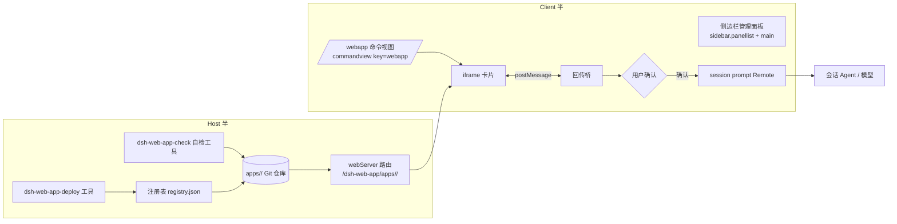

# MVP 设计

> 本文档由 grilling 访谈（见 [decisions.md](decisions.md)）收敛而来。每条结论标注了来源问题编号。

## 1. 总览

dsh-web-app 是一个 DSH 插件（host 半 + client 半 + 分层 skills），提供四类能力：

1. **制作与部署**：AI 在 `webapp-author` skill 指导下编写单文件 HTML + 元数据 + 回传模板，调用 `dsh-web-app-deploy` 工具完成首次部署（建档 + git init + 首次提交）。
2. **展示**：用户用 `/webapp` 斜杠命令在对话内嵌打开 webapp（**不触发模型调用**）。
3. **回传**：用户在 webapp 内组好数据后一次性提交；插件按填空模板渲染成用户消息，经确认后注入会话，驱动模型决策。
4. **管理**：侧边栏面板查看应用列表与版本；对话内卡片提供刷新按钮获取新版本。

## 2. 架构

## 3. 组件清单

### 3.1 Host 半

| 组件 | 机制 | 职责 |
| --- | --- | --- |
| `dsh-web-app-deploy` 工具 | `tools.register` | 首次部署：接收 `name` + `html` + `metadata` + `template`，创建 `apps/<name>/`，`git init` + 首次提交，登记注册表。**同名拒绝**（Q17） |
| `dsh-web-app-check` 自检工具 | `tools.register` | 校验目录结构、元数据 schema、模板与变量一致性、回传桥存在性（Q16） |
| 注册表 `registry.json` | 插件数据目录 | `name → { description, repoPath, deployedRef: { branch, commit } }`（Q11） |
| 静态伺服路由 | `webServer.register` | 按 `deployedRef` 出文件；URL 带 commit hash 做缓存破除 |
| （预留）回传 HTTP 端点 | `webServer.register` | MVP 不用；为 TUI/HTTP 通道预留（roadmap ①） |

### 3.2 Client 半

| 组件 | 机制 | 职责 |
| --- | --- | --- |
| `/webapp` 命令视图 | slot `conversation.chat.commandview`，key=`webapp` | 内嵌卡片：无参时显示应用选择器；有参时直开（Q2）。卡片含 iframe、刷新按钮（Q17）、全屏按钮 |
| 全屏 | `layout.openRightbar(track, fullscreen)` 或 `shell.overlay` | 把 iframe 放大到全屏（Q1） |
| 回传桥 | iframe `postMessage` | 收 `submit` → 模板渲染 → 确认 UI → `sessionController.prompt` 注入（Q4/Q8） |
| 去重器 | 会话内状态 | 同 turn + payload 严格一致 → 拦截第二次（Q7/Q19） |
| 管理面板 | `sidebar.panellist` + keyed `main` + `layout.selectPanel` | 应用列表、当前版本展示（Q13/Q18） |

### 3.3 Skills（分层，Q15）

| Skill | 触发时机 | 内容 |
| --- | --- | --- |
| `dsh-web-app-author` | 制作/编辑 webapp | 目录契约、变量词表、模板写法、回传 API、自检流程、Playwright/浏览器自动化目测验证（Q16） |
| `dsh-web-app-interpret` | 解读回传结果 | 如何理解模板渲染出的"用户汇报"、变量语义以模板作者声明为准（Q14） |

## 4. 显示面（Q1）

- GenUI 是白名单组件树，任意 HTML 进不去（安全设计）；webapp 走 **commandview + iframe** 路线，视觉位置与 GenUI 卡片一致（对话流内一张卡片）。
- iframe `src` 由 host 路由伺服（同 origin），卡片内固定高度、可展开全屏。
- 会话重载/回放时 commandview 重新挂载 ⇒ iframe 状态丢失。**已接受**（Q6：一次性提交，正常 Web UI 亦如此）。
- 「用户打开过某 webapp」**不**向后续 turn 的模型暴露（Q3）；command 节点留痕仅供用户侧回溯。

## 5. 斜杠命令 UX（Q2）

- 单命令 `/webapp [name]`：`name` 可选，做深链；无参时卡片内渲染应用选择器（从注册表读取），不让用户背名字。
- 不做动态命令注册；新部署的应用自动出现在选择器里。

## 6. 回传链路（Q4-Q8）

1. webapp 内用户点击「提交」→ 应用 JS 收集变量值，`postMessage` 给卡片桥。
2. 桥读取该应用的**填空模板**，把变量值渲染成最终文本。
3. **确认 UI**（默认开启，Q8）：展示将发送的完整文本 + 确认/取消。`app.json` 可声明 `confirm: false`（AI 开发期判断内容不适合打扰用户时），此时卡片常驻一条风险提示。
4. 确认后去重检查（Q7）：**同一 turn、且未被压缩/打断、且 payload 严格一致** ⇒ 拒绝重发并提示。其余情况照传（Q19：用户刻意双端各发一次也照传，只要不完全相同）。
5. 经 `sessionController.prompt` Remote 注入为**当前会话**的用户消息，触发模型 turn。

- 模板内容（Q4）：AI 在开发期编写，独立文件存放于应用目录；模板至少携带 webapp 名、版本、动作类型、各变量值及其语义声明。
- 传输与防伪造（Q5 ✅）：门票 token（伺服时盖章、每次加载新发）+ 结构校验；威胁模型为「AI 代码缺陷/多实例串话」，兜底是 Q8 用户确认。详见 [callback-contract.md](callback-contract.md) §5。

## 7. 部署与版本（Q11-Q13、Q17）

- 首次部署：`deploy` 工具接收 `name + html + metadata + template` → 创建 `apps/<name>/`（`index.html`、`app.json`、`callback.template.md`）→ `git init` + 首次提交 → 登记注册表。**同名拒绝**，换名重来（Q17）。
- 此后所有修改**直接在仓库目录内进行**（普通文件工具 + git 提交，由 `webapp-author` skill 教模型这套流程，Q11）。
- 部署指针：注册表记录 `deployedRef = { branch, commit }`，伺服按指针出文件；默认指向主分支最新提交。
- 「宣布新版本」（Q13）：对模型 = 工具返回值文本（进入上下文）；对用户 = 侧边栏面板展示当前使用版本，细节引导用户与 AI 对话了解。
- 旧版实例：卡片**刷新按钮**重新拉取部署指针处内容（Q17）。
- `metadata` 含应用的一句话简介，显示在选择器与面板里（Q17）。

## 8. 管理面板（Q13/Q18）

- 入口：`sidebar.panellist`（全局面板图标，与已安装的「自动化任务」插件同一机制——已知此机制存在即可，无需调研其细节）注册图标 → 点击 `layout.selectPanel` 打开 keyed `main` 面板。
- 内容：应用列表（名称、简介、当前部署版本/分支、仓库状态）、删除入口（MVP 包含删除，Q18）。
- 删除 = 移除目录 + 注册表条目；已打开的卡片实例显示「已删除」占位。

## 9. 调试闭环（Q15/Q16）

- `dsh-web-app-check` 工具：结构/元数据/模板变量一致性/回传桥存在性校验。
- `webapp-author` skill 要求模型：部署后跑 check；必要时用 Playwright/浏览器自动化实际打开 HTML 目测（Q16）。
- MVP 接受「盲写 + 自检工具 + 可选浏览器验证」的组合，不做运行时 console 回传。

## 10. 安全模型

| 面 | 措施 |
| --- | --- |
| 任意 HTML 在客户端执行 | iframe `sandbox` 属性隔离；不授予 `allow-same-origin` 之外的权限 |
| 伪造回传驱动模型 | 门票 token（伺服时盖章、每次加载新发，Q5 ✅）+ **默认用户确认**（Q8） |
| `confirm: false` 滥用 | 卡片常驻风险提示（Q8） |
| 跨会话注入 | MVP 不做选择器，回传**只进当前会话**（Q9）；跨会话设计冻结至 TUI 时代（Q10，见 roadmap） |
| 双端重复回传 | 同 turn + 严格一致 payload 去重（Q7/Q19） |

## 11. 待定项

**全部关闭**（2026-10-09 拍板，见 [decisions.md](decisions.md)）：

- Q5 → 门票 token（伺服时盖章、每次加载新发）+ 结构校验；
- Q14a → **伺服时盖章**：仓库存占位符源码，路由响应时替换保留占位符——兼得「盖章的零初始化代码」与「仓库零污染、token 按次发放、版本号正确」。
